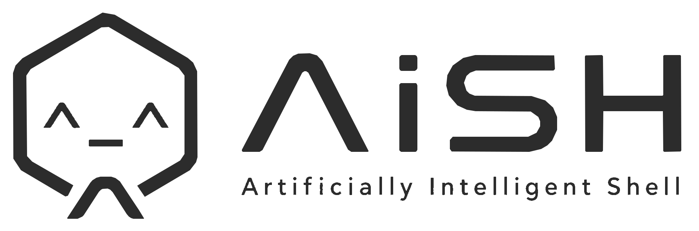

<p align="center">
  <picture>
    <source media="(prefers-color-scheme: dark)" srcset="apps/site/public/brand/aish-full-horizontal-white.svg">
    
  </picture>
</p>

<h1 align="center">AiSH</h1>

<p align="center">
  AI-native provider shell by Dawnlight Labs.
</p>

<p align="center">
  <a href="#install">Install</a> ·
  <a href="#features">Features</a> ·
  <a href="docs/ARCHITECTURE.md">Architecture</a> ·
  <a href="docs/wiki/Home.md">Wiki</a> ·
  <a href="SECURITY.md">Security</a>
</p>

---

## What is AiSH?

AiSH is a provider shell that turns natural-language intent into shell-aware command plans while keeping execution inside real terminals.

It is designed for developers who want AI help in the terminal without losing command visibility, shell control, or approval gates for destructive actions.

```text
AiSH = provider shell + context engine + CLI knowledge layer + approval gates + optional local Ken model
```

AiSH is a Dawnlight Labs pilot project.

## Current shape

The active `main` branch ships the provider shell and supporting website/docs.

The old Tauri desktop app has been archived on the `app-provider-archive` branch. New work on `main` should not describe AiSH as the old desktop app unless it is referring to that archive.

## Install

### Windows PowerShell

```powershell
irm https://aish.dawnlightlabs.com/install.ps1 | iex
```

### macOS / Linux

```bash
curl -fsSL https://aish.dawnlightlabs.com/install | bash
```

Backup downloads are published on GitHub Releases.

## Setup

Interactive setup:

```bash
aish --install
```

Headless setup:

```bash
aish --install-headless --add-path --set-model-path --editor-profiles --model-check
```

Legacy setup remains available:

```bash
aish --setup
```

## Features

- AI Run mode for shell-aware command planning.
- Local-first model path support where configured.
- Read-only commands can run quickly after validation.
- Destructive and system-impacting commands require approval.
- Command previews before execution.
- Windows Terminal and VS Code-compatible terminal profile setup.
- macOS/Linux shell profile setup.
- Website and release-download flow for public distribution.

## Safety model

AiSH is intentionally approval-gated.

Commands that delete files, overwrite data, install packages, edit shell profiles, alter PATH, run installers, use elevated privileges, or modify system state should require explicit user approval.

No generated candidate should bypass the safety layer.

## Development

```bash
git clone https://github.com/amaansyed27/aish.git
cd aish
cargo check --workspace
cargo build --release -p aish-provider-shell
npm install
npm run site:build
```

Use the active Node.js LTS line for new automation. Do not pin new workflows to deprecated Node.js runtimes.

## Repository docs

- [Architecture](docs/ARCHITECTURE.md)
- [Development Guide](docs/DEVELOPMENT.md)
- [Release Checklist](docs/RELEASES.md)
- [Troubleshooting](docs/TROUBLESHOOTING.md)
- [Roadmap](docs/ROADMAP.md)
- [Brand Notes](docs/BRAND.md)
- [Wiki Home](docs/wiki/Home.md)
- [Contributing](CONTRIBUTING.md)
- [Support](SUPPORT.md)
- [Security Policy](SECURITY.md)
- [Code of Conduct](CODE_OF_CONDUCT.md)

## Contributing

Issues and pull requests are welcome. Read [CONTRIBUTING.md](CONTRIBUTING.md) before opening a PR.

For bugs, use the bug report template. For feature requests, describe the workflow first and the proposed implementation second.

Do not report vulnerabilities in public issues. Follow [SECURITY.md](SECURITY.md).

## License

MIT License. See [LICENSE](LICENSE).

Copyright © 2026 Dawnlight Labs and contributors.
