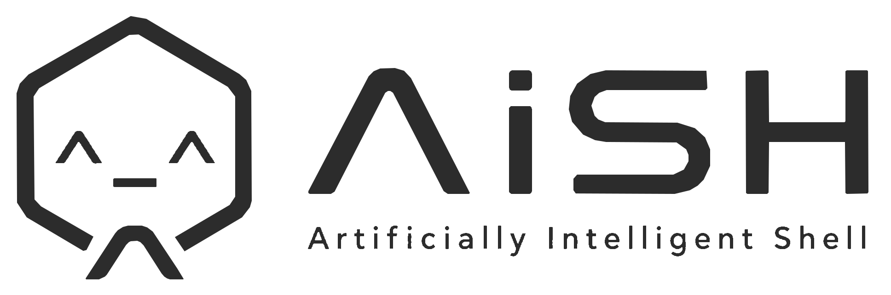

<p align="center">
  <picture>
    <source media="(prefers-color-scheme: dark)" srcset="apps/site/public/brand/aish-full-horizontal-white.svg">
    
  </picture>
</p>

<h1 align="center">AiSH</h1>

<p align="center">
  AI-native provider shell by Dawnlight Labs.
</p>

<p align="center">
  <a href="#install">Install</a> ·
  <a href="#features">Features</a> ·
  <a href="docs/ARCHITECTURE.md">Architecture</a> ·
  <a href="docs/wiki/Home.md">Wiki</a> ·
  <a href="SECURITY.md">Security</a>
</p>

---

## What is AiSH?

AiSH is a provider shell that turns natural-language intent into shell-aware command plans while keeping execution inside real terminals.

It is designed for developers who want AI help in the terminal without losing command visibility, shell control, or approval gates for destructive actions.

```text
AiSH = provider shell + context engine + CLI knowledge layer + approval gates + optional local Ken model
```

AiSH is a Dawnlight Labs pilot project.

## Current shape

The active `main` branch ships the provider shell and supporting website/docs.

The old Tauri desktop app has been archived on the `app-provider-archive` branch. New work on `main` should not describe AiSH as the old desktop app unless it is referring to that archive.

## Install

### Windows PowerShell

```powershell
irm https://aish.dawnlightlabs.com/install.ps1 | iex
```

The Windows installer is user-level and does not require administrator rights. It registers AiSH in Start menu search and Windows Installed apps, adds the provider shell to PATH, creates the terminal integrations selected during setup, and installs an uninstaller.

Existing Windows users can rerun the same command to repair or add app registration without removing their current AiSH setup first.

### macOS / Linux

```bash
curl -fsSL https://aish.dawnlightlabs.com/install | bash
```

Backup downloads are published on GitHub Releases.

## Setup

Interactive setup:

```bash
aish --install
```

Headless setup:

```bash
aish --install-headless --add-path --set-model-path --editor-profiles --model-check
```

Legacy setup remains available:

```bash
aish --setup
```

## Updates

AiSH checks GitHub Releases at most once every 24 hours when the provider shell starts. When a newer stable release exists, AiSH shows the installed and available versions and asks before applying the update.

Manual update checks remain available:

```bash
aish --update
```

Inside the provider shell:

```text
/update
```

To disable automatic checks, set `AISH_SKIP_UPDATE_CHECK=1`. The optional `AISH_UPDATE_CHECK_HOURS` environment variable changes the check interval.

## Uninstall

AiSH 0.3.0 and newer can be removed with:

```bash
aish --uninstall
```

For unattended removal:

```bash
aish --uninstall --yes
```

On Windows this removes the Start menu shortcut, Installed apps entry, App Paths entry, PATH entry, Windows Terminal profile, supported editor terminal profiles, and the installed AiSH files. A separately downloaded model outside the AiSH install directory is preserved.

## Features

- AI Run mode for shell-aware command planning.
- Local-first model path support where configured.
- Native BYOK AI Run providers: OpenAI, Anthropic, Gemini, OpenRouter, Groq, Ollama, Mistral, Together, DeepSeek, xAI, Perplexity, Fireworks, and custom OpenAI-compatible APIs.
- Provider selection is persisted locally, while API keys remain in standard environment variables and are never saved by AiSH.
- Read-only commands can run quickly after validation.
- Destructive and system-impacting commands require approval.
- Command previews before execution.
- Automatic update availability prompts with explicit approval.
- Windows Start menu and Installed apps registration.
- Windows Terminal and VS Code-compatible terminal profile setup.
- macOS/Linux shell profile setup.
- Website and release-download flow for public distribution.

## Safety model

AiSH is intentionally approval-gated.

Commands that delete files, overwrite data, install packages, edit shell profiles, alter PATH, run installers, use elevated privileges, or modify system state should require explicit user approval.

No generated candidate should bypass the safety layer.

## Bring your own key (BYOK)

Run `/setup` for the guided path. It first checks whether the recommended GGUF model is already available and asks before downloading it. You can instead select an existing GGUF file anywhere on disk; AiSH uses it in place without copying or modifying it.

The setup then offers cloud BYOK. Select one or more providers in fallback order, choose each model, and optionally enter each key. Provider choices remain in local settings; entered keys are stored in the operating system credential vault and are never written to AiSH JSON files. AiSH tries the enabled providers left-to-right when a cloud request fails. Run `/provider setup` to change this later.

Environment variables such as `OPENAI_API_KEY`, `ANTHROPIC_API_KEY`, `GEMINI_API_KEY`, `OPENROUTER_API_KEY`, and `GROQ_API_KEY` still work and take precedence over a stored vault key. For a compatible gateway or self-hosted server, use `/provider custom <https://endpoint/v1> <model> <API_KEY_ENV>`. Use `/provider off` to return to the selected local GGUF model.

## Development

```bash
git clone https://github.com/DawnlightLabs/AiSH.git
cd AiSH
cargo check --workspace
cargo build --release -p aish-provider-shell
npm install
npm run site:build
```

Use the active Node.js LTS line for new automation. Do not pin new workflows to deprecated Node.js runtimes.

## Repository docs

- [Architecture](docs/ARCHITECTURE.md)
- [Development Guide](docs/DEVELOPMENT.md)
- [Release Checklist](docs/RELEASES.md)
- [Troubleshooting](docs/TROUBLESHOOTING.md)
- [Roadmap](docs/ROADMAP.md)
- [Brand Notes](docs/BRAND.md)
- [Wiki Home](docs/wiki/Home.md)
- [Contributing](CONTRIBUTING.md)
- [Support](SUPPORT.md)
- [Security Policy](SECURITY.md)
- [Code of Conduct](CODE_OF_CONDUCT.md)

## Contributing

Issues and pull requests are welcome. Read [CONTRIBUTING.md](CONTRIBUTING.md) before opening a PR.

For bugs, use the bug report template. For feature requests, describe the workflow first and the proposed implementation second.

Do not report vulnerabilities in public issues. Follow [SECURITY.md](SECURITY.md).

## License

MIT License. See [LICENSE](LICENSE).

Copyright © 2026 Dawnlight Labs and contributors.
